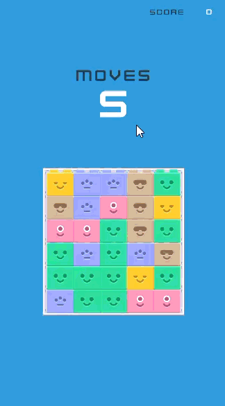

# 🎮 Block Cascade

**Dynamic grid-based puzzle game with connected-block matching and automatic chain reactions**

---

## 📋 Project Summary

**Block Cascade** is an interactive puzzle game developed as a multi-phase technical assessment. The project demonstrates core game development concepts including grid systems, collision detection via flood-fill algorithms, coroutine-based state management, and UI integration. Built in **Unity 6.0**, it showcases professional C# architecture using singleton patterns, event-driven design, and dynamic visual updates.

**Development Context:** Three sequential tasks building gameplay incrementally from UI setup → game state management → complete game loop with chain reactions.

---

## 🎯 Project Overview

Players interact with a dynamically generated 5×6 grid of colored blocks. Clicking a block triggers collection of all connected blocks of the same color (2+ blocks required). Points are awarded, a move is consumed, and the grid refills with blocks falling from above. When blocks match after refill, a chain reaction occurs automatically—awarding bonus points without consuming additional moves. The game ends when all 5 starting moves are exhausted.

**Key Feature:** Automatic chain-reaction detection at the originally clicked position prevents board stalls and rewards spatial planning.

---

## ✨ Key Features

- **Dynamic Grid Generation** – Random block assignment with 5-color palette
- **Connected Block Detection** – Flood-fill algorithm finds all adjacent same-colored blocks
- **Gravity System** – Blocks fall to fill gaps; visual positioning updated in real-time
- **Chain Reactions** – Automatic detection of matches after refill; bonus points awarded without move cost
- **Move/Score Tracking** – Real-time UI updates via TextMeshPro
- **Game State Management** – Start, play, and reset game lifecycle with persistent UI state
- **Responsive Interaction** – Pointer input handling with click validation (game active + moves remaining)

---

## 🖼️ Preview


---
**Game Interface:**
- Top section: Score and remaining moves counters
- Center: 5×6 interactive grid of colored blocks
- Bottom: Replay button to reset game state

  [🎮 **Play Demo**](https://abrahamsanchezdev.github.io/blocks-cascade/)

---

## 📁 Project Structure

```
Assets/
├── Scenes/
│   └── Main.unity                 # Main gameplay scene
├── Scripts/
│   ├── GameManager.cs             # Singleton: Score, moves, game state
│   ├── GridManager.cs             # Singleton: Grid creation, block collection, refill
│   ├── Block.cs                   # Block component: position, icon, click handling
│   ├── BlocksDb.cs                # ScriptableObject: Icon/sprite database
│   └── UIManager.cs               # UI updates (likely referenced in Main.unity)
├── Prefabs/
│   └── Block.prefab               # Block game object template
└── TextMesh Pro/
    └── Resources/                 # TMP fonts and materials

ProjectSettings/
├── ProjectVersion.txt             # Unity 6.0.3.10f1
└── ProjectSettings.asset          # Player settings
```

**Key Game Objects:**

- `GridParent` (Transform): Container for all block instances
- `Block Prefab`: RectTransform + Image + Block script + PointerEventHandler
- `GameOverPanel`: Canvas panel shown when moves reach 0
- `ScoreText` / `MovesText`: TextMeshPro UI elements
- `ReplayButton` / `MakeMoveButton`: UGUI Button components

---

## 🏗️ Architecture Highlights

**Singleton Pattern**

- `GameManager.Instance` – Global state: score, moves, active flag, game-over visibility
- `GridManager.Instance` – Global state: grid 2D array, block prefabs, refill logic

**Event-Driven Block Interaction**

- Block script implements `IPointerDownHandler`; delegates to GridManager.OnBlockClicked()
- GridManager validates move availability and initiates coroutine-based collection

**Flood-Fill Algorithm (Connected-Component Detection)**

- BFS with Queue + HashSet for O(n) visit per block
- Explores 4-adjacent neighbors; stops at different-colored blocks
- Returns all connected blocks for single atomic removal

**Coroutine-Based State Management**

- Separates removal (instant) from visual settling (1s wait) from refill (multi-step)
- Chains operations: collect → wait → refill → check position for chain
- Prevents concurrent modifications via `isProcessing` flag

**Grid Refill Pipeline**

1. Blocks fall down (gravity simulation)
2. Empty slots filled top-down with new blocks
3. Position checked for chain matches (recursive refill if found)
4. Game-over state evaluated after all chains complete

**UI Synchronization**

- GameManager calls `UpdateUI()` after AddScore/UseMove
- TextMeshPro fields bound in Inspector
- GameOverPanel toggled via SetActive on end-game

---

## 🛠️ Technology Stack

| Technology         | Purpose                                           |
| ------------------ | ------------------------------------------------- |
| **Unity 6.0.3**    | Engine, 2D rendering, input handling              |
| **C# 12**          | Game logic, OOP architecture                      |
| **TextMeshPro**    | High-quality text rendering for UI (score, moves) |
| **UGUI (Canvas)**  | UI layout, buttons, panels, event system          |
| **2D Feature Set** | Sprite rendering, RectTransform positioning       |

---

## 🧠 Code Quality & Engineering

**Professional Standards**

- **Documented via XML comments** – GameManager, GridManager, Block classes describe purpose and responsibilities
- **Single Responsibility** – Each class owns one system (game state, grid logic, block interaction)
- **No magic numbers** – Configurable Inspector fields (gridWidth, gridHeight, cellSize, initialMoves)
- **Defensive checks** – Null validation, bounds checking, game-active state verification
- **Separation of concerns** – Grid logic isolated from game state; UI updates delegated to GameManager

**Patterns Applied**

- Singleton for global managers (thread-safe within single-threaded game loop)
- Scriptable Object for data (BlocksDb) – reusable, serializable asset
- Coroutine chaining for sequential async operations
- State flag (`isProcessing`) prevents race conditions during multi-step operations

**Code Reuse**

- CreateBlock overloaded for initial setup and refill
- CheckAdjacent extracted for clarity in flood-fill
- CalculateGridOffset shared across create and refill logic

---

## 🚀 How to Build & Run Locally

**Prerequisites**

- Unity 6.0.3 or later
- Visual Studio / Rider (C# IDE)

**Steps**

1. **Clone the repository:**

   ```bash
   git clone https://github.com/AbrahamSanchezDev/blocks-cascade.git
   cd blocks-cascade
   ```

2. **Open in Unity:**
   - Launch Unity Hub → Open Project → select `block-cascade` folder
   - Wait for library import (first load ~1–2 min)

3. **Run in Editor:**
   - Open `Assets/Scenes/Main.unity`
   - Press **Play** (Ctrl+P)
   - Click blocks to collect; observe score/moves update
   - Move count to 0 triggers Game Over; click Replay to reset

4. **Build WebGL Demo** (for hosting):

   ```
   File → Build Settings
   → Switch Platform to WebGL
   → Add Scenes/Main.unity to Scenes In Build
   → Build (output: WebGL folder)
   → Deploy contents to GitHub Pages or itch.io
   ```

5. **Build Standalone** (Windows/Mac/Linux):
   ```
   File → Build Settings
   → Switch Platform (e.g., Windows Standalone)
   → Build (generates .exe or equivalent)
   ```

---

## 📚 Development Insights

**Task Progression**

| Task       | Focus              | Outcome                                                                        |
| ---------- | ------------------ | ------------------------------------------------------------------------------ |
| **Task 1** | Asset Integration  | UI hierarchy (Canvas, Score/Moves texts, buttons, Game Over panel)             |
| **Task 2** | Data Handling      | GameManager singleton, score/moves state, test "Make Move" button              |
| **Task 3** | Gameplay Mechanics | Full game loop: block collection, grid refill, chain reactions, move decrement |

**Architecture Evolution**

- Task 1: Static UI mockup
- Task 2: State management + UI binding
- Task 3: Dynamic grid, interaction handling, event-driven refill

**Extra Feature Implemented**

- Chain reactions at the original clicked position: If blocks fall and match after refill, the system automatically triggers another collection without consuming a move. This prevents board stalls and adds strategic depth (players can plan for chain potential).

---

## 🎓 Learning Outcomes

This project demonstrates:

1. **Game State Management** – Singleton pattern for centralized, accessible state
2. **Grid-Based Systems** – 2D array manipulation, position tracking, dynamic refill
3. **Algorithm Implementation** – Flood-fill for connected-component detection (BFS variant)
4. **Asynchronous Programming** – Coroutines for multi-step animations without blocking
5. **UI/UX Integration** – Binding data to TextMeshPro, button callbacks, panel visibility toggling
6. **Professional C# Patterns** – Event handlers (IPointerDownHandler), Scriptable Objects, encapsulation
7. **Debugging & Optimization** – Using Gizmos for grid visualization; `isProcessing` flag for race prevention
8. **Incremental Development** – Building from static UI → interactive state → full game loop

---

**Repository:** [https://github.com/AbrahamSanchezDev/blocks-cascade](https://github.com/AbrahamSanchezDev/blocks-cascade)  
**Built with:** [Unity 6.0.3](https://unity.com/)
